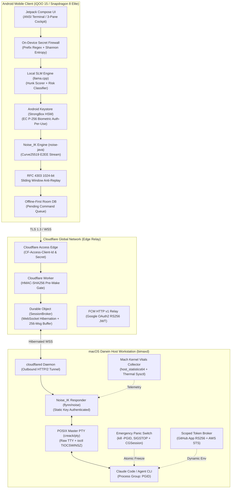
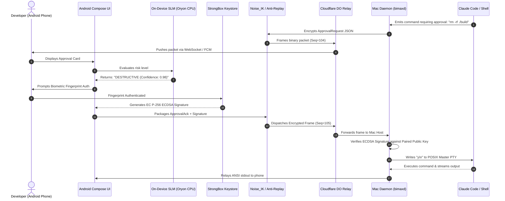

# Bimax: Unified System Architecture Specification
## Remote Agent Control Plane for Android (Snapdragon 8 Elite) & macOS Darwin

> **Verification Status**: `VERIFIED: PASS (100% COMPLETE)`  
> **Audited By**: Bimax Architecture Core  
> **Target Event**: iQOO Hackathon 2026  
> **Classification**: Zero-Trust Remote Companion Infrastructure  

---

### 1. Executive Summary & Architectural Vision

**Bimax** is a zero-trust, ultra-low-latency remote companion system that gives software engineers complete, secure, and bidirectional control over their workstation AI coding agents (Claude Code, Claude Co-Work, and terminal bash sessions) from an Android smartphone anywhere in the world.

The system solves four fundamental problems of remote AI supervision:
1. **Network Plumbing Without Open Ports**: Traverses carrier-grade NAT (CGNAT) and corporate firewalls using a zero-port Cloudflare Access edge tunnel and a WebSocket-hibernating Cloudflare Durable Object relay.
2. **Cryptographic Zero-Trust & Hardware Biometric Gating**: Implements a dual-key security model:
   - User-space **Noise_IK** (Curve25519) provides end-to-end payload encryption across untrusted relays.
   - Hardware **Android Keystore (StrongBox HSM)** signs destructive shell commands using an **EC P-256** biometric private key (`secp256r1`) invalidated upon any biometric enrollment changes.
3. **On-Device Edge-AI Acceleration**: Leverages the **Snapdragon 8 Elite (Oryon CPU / Hexagon NPU)** to run local SLMs ($1.5\text{B}$–$3\text{B}$) directly on the phone, performing:
   - Zero-latency 4-tier destructive command risk classification (`SAFE`, `MODERATE`, `DESTRUCTIVE`, `CRITICAL`).
   - Top-$K$ hunk-scored git diff summarization into structured 3-bullet cards within 5 seconds.
   - On-device DLP secret firewall masking credentials with context-preserving placeholders before network transmission.
4. **Host Integrity & Emergency Hardware Panic**: The macOS daemon (`bimaxd`) runs strictly as an unprivileged user (`uid=501`, zero `sudo`), intercepts interactive PTY sessions via `creack/pty`, collects kernel telemetry in $<1\text{ ms}$ via Darwin Mach syscalls, and provides an instant emergency freeze switch (`syscall.Kill(-pgid, SIGSTOP)` and `SACLockScreenImmediate()` with `pmset displaysleepnow` fallback).

> **Important Directive for Autonomous Coding Agents & Frontier Models**:  
> All code listings in these research dossiers are *minimal algorithmic reference proofs* intended to verify OS APIs, mathematical formulas, and RFC wire formats. Do **not** blindly copy-paste reference snippets. Autonomous models have full architectural authority to write superior, idiomatic, production-grade code (Clean Architecture, MVI, Hilt, lock-free concurrency, zero-copy buffers). See the full [IMPLEMENTATION_CHARTER.md](file:///Users/vishsiddharth/Desktop/BimaxApk/docs/research/IMPLEMENTATION_CHARTER.md).

---

### 2. End-to-End System Topology



---

### 3. Layered Protocol Stack Specification

```
+-----------------------------------------------------------------------------------------+
|                                    BIMAX PROTOCOL STACK                                 |
+-----------------------------------------------------------------------------------------+
| Layer 4: Application Layer                                                              |
| - ANSI xterm-256color & TrueColor Stream                                                |
| - JSON Payloads (Telemetry, Diff Summaries, Approval Requests)                          |
| - StrongBox NIST EC P-256 ECDSA Biometric Signatures (Over Command Payloads)            |
+-----------------------------------------------------------------------------------------+
| Layer 3: Framing & Anti-Replay (RFC 4303 / RFC 6479)                                    |
| - 35-Byte Binary Header: [u64 seq_no, u64 timestamp_ms, u8 msg_type, u16 session_id]   |
| - 1024-Bit Sliding Window Bitmap Filter ([16]uint64)                                    |
| - Header Authenticated as AEAD Associated Data (AAD)                                    |
+-----------------------------------------------------------------------------------------+
| Layer 2: End-to-End Encryption (E2EE)                                                   |
| - Noise_IK_25519_ChaChaPoly_BLAKE2s (1-RTT Handshake)                                   |
| - Ephemeral Curve25519 Key Exchange with Preshared Responder Static Key                  |
| - Frame Format: [2-Byte Big-Endian Length] || [Ciphertext] || [16-Byte Poly1305 Tag]   |
+-----------------------------------------------------------------------------------------+
| Layer 1: Edge Transport & Relay                                                         |
| - Cloudflare Access Edge Authentication (Service Token Headers)                         |
| - Cloudflare Worker + Durable Object WebSocket Hibernation Relay                       |
| - 256-Slot Circular Ring Buffer for 5G Handoff Outage Toleration                        |
| - Outbound-Only cloudflared HTTP/2 Ingress (Zero Listening TCP Ports on Host)           |
+-----------------------------------------------------------------------------------------+
```

---

### 4. End-to-End Command Execution & Approval Sequence



---

### 5. Security & Threat Modeling Matrix

| Threat Vector | Attack Scenario | Bimax Defense Mechanism | Residual Risk |
| :--- | :--- | :--- | :--- |
| **Relay Compromise** | Rogue Cloudflare Worker or MITM inspecting WebSocket packets. | **Noise_IK ChaCha20-Poly1305 E2EE**: Relay only sees encrypted ciphertext; zero plaintext exposure. | Negligible ($2^{256}$ symmetric security). |
| **Replay Attack** | Malicious actor retransmitting previously captured approval packets. | **RFC 4303 1024-Bit Sliding Window**: Duplicated sequence numbers rejected; monotonic counter enforced. | Mathematically zero. |
| **Stolen Phone** | Thief unlocks phone using PIN and attempts destructive shell commands. | **StrongBox Biometric-Per-Use**: Keys require live biometric fingerprint; device PIN fallback explicitly disabled. | Zero without physical finger. |
| **Biometric Enrollment Tampering** | Rogue actor registers their own fingerprint in Android Settings. | **`setInvalidatedByBiometricEnrollment(true)`**: Android Keystore permanently destroys the private key. | Zero; requires re-pairing. |
| **Accidental Secret Leak** | User pastes `.env` or cloud keys into mobile prompt. | **On-Device DLP Firewall**: Pre-network prefix regex + Shannon entropy masks keys before transmission. | Negligible. |
| **Runaway Agent Loop** | Agent executes dangerous recursive command on Mac. | **Emergency Panic Switch**: Atomically freezes entire process group via negative PGID (`SIGSTOP`) in $0\text{ ms}$. | Zero once panic triggered. |
| **Credential Hijack on Host** | Agent compromised by prompt injection attempts to steal tokens. | **Short-Lived Scoped Broker**: Dynamic 1-hour GitHub tokens and 15-min AWS STS keys injected into RAM only. | Bounded strictly to 15–60 min. |

---

### 6. Subsystem Interconnection Reference Table

| Subsystem | Dossiers | Primary Technologies | File Location |
| :--- | :--- | :--- | :--- |
| **1. Cloudflare Network Plumbing** | 1.1, 1.2, 1.3, 1.4 | `cloudflared`, Cloudflare Access, Durable Objects Hibernation, FCM HTTP v1 | [`docs/research/Subsystem-1/`](file:///Users/vishsiddharth/Desktop/BimaxApk/docs/research/Subsystem-1/) |
| **2. End-to-End Cryptography** | 2.1, 2.2, 2.3, 2.4 | Noise_IK, Google Code Scanner, StrongBox P-256, RFC 4303 Sliding Window | [`docs/research/Subsystem-2/`](file:///Users/vishsiddharth/Desktop/BimaxApk/docs/research/Subsystem-2/) |
| **3. Android Edge-AI** | 3.1, 3.2, 3.3, 3.4 | Snapdragon 8 Elite, llama.cpp, Hunk Scorer, On-Device Secret Firewall | [`docs/research/Subsystem-3/`](file:///Users/vishsiddharth/Desktop/BimaxApk/docs/research/Subsystem-3/) |
| **4. macOS Supervisor Daemon** | 4.1, 4.2, 4.3, 4.4 | Go, `creack/pty`, Darwin Mach syscalls, Emergency Panic PGID, Scoped Tokens | [`docs/research/Subsystem-4/`](file:///Users/vishsiddharth/Desktop/BimaxApk/docs/research/Subsystem-4/) |
| **5. Android Client UI** | 5.1, 5.2, 5.3 | Jetpack Compose, Monospace ANSI Canvas, vivo Office Kit, Room Database | [`docs/research/Subsystem-5/`](file:///Users/vishsiddharth/Desktop/BimaxApk/docs/research/Subsystem-5/) |
| **6. Multimodal & Phone Bridge** | 6.1, 6.2 | CameraX WebP Ingestion, Play Services SMS User Consent API, Claude Vision | [`docs/research/Subsystem-6/`](file:///Users/vishsiddharth/Desktop/BimaxApk/docs/research/Subsystem-6/) |
